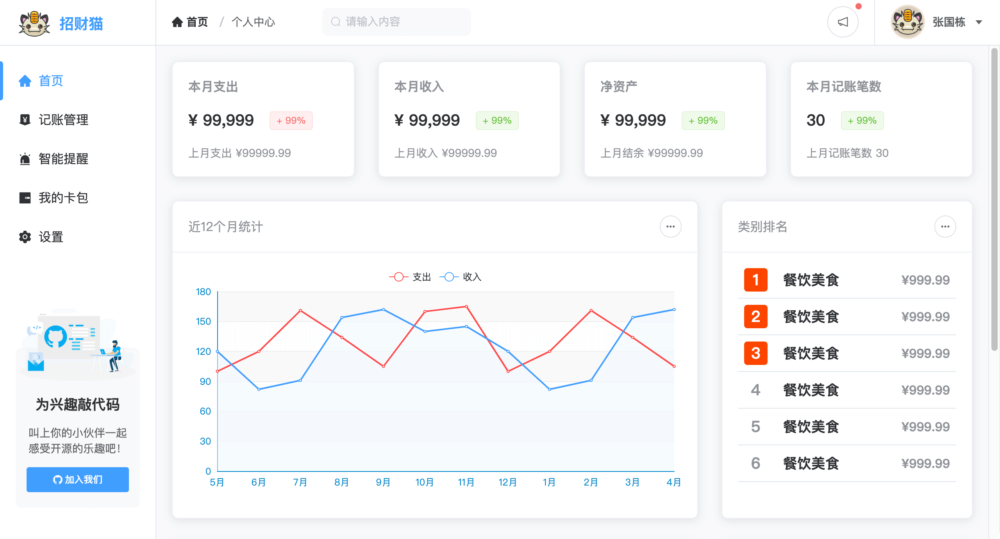

# LanMiaoDesktopOnline

## 概述

这是区别于主分支 [LanMiaoDesktop-master](https://github.com/hilanmiao/LanMiaoDesktop) 的网络版，
需要配合我的另一个开源项目 [招财猫](https://github.com/hilanmiao/smart-miao) 进行开发。

核心框架：
- [electron-forge](https://github.com/electron-userland/electron-forge) 6.x
- webpack 5.x
- vue 2.x
- element-ui 2.x

> 由于 [electron-vue](https://github.com/SimulatedGREG/electron-vue) 框架的各种意义上说都已经很落后了，尤其是 electron 版本支持极低，所以切换为 electron-forge 框架，这是亲儿子，官方推荐使用 

[招财猫](https://github.com/hilanmiao/smart-miao) 是一个全栈开源项目：

- 基于`Egg.js 2.x`和`nodejs 16.x`的后端工程
- 基于`Vue.js 2.x`的前端工程
- 基于`Uniapp、uviewui 1.x`的移动端工程
- 基于`Bulma.css 0.9.x`的产品营销网站

注意：
- 您需要首先启动后端工程，否则无法正常调用接口。

- 如果您无法搭建后端工程环境，您也可以使用我 [演示网址](https://demo.smartmiao.com/) 的 接口地址(https://services.smartmiao.com/api)，

- 如果您想用自己开发的接口，您可以从登录接口开始一步一步替换接口 （本项目没有设计权限功能，相关功能在web端都已经实现了，所以改起来很简单）

## 应用截图



## 开发说明

``` bash
# install dependencies
npm install

# serve with hot reload at localhost:9000
npm run start

# build electron application for production
npm run make

```

## 开源协议

本项目基于 [MIT](http://opensource.org/licenses/MIT) 协议，请自由地享受和参与开源。


[//]: # (## 个人著作权)

[//]: # ()
[//]: # (本软件已经在 [中国版权保护中心]&#40;https://www.ccopyright.com.cn/&#41; 申请了著作权，请不要直接拿发行版软件包进行商业行为，也请注意开发时尽量把)

[//]: # (我的个人信息替换为你的。)
